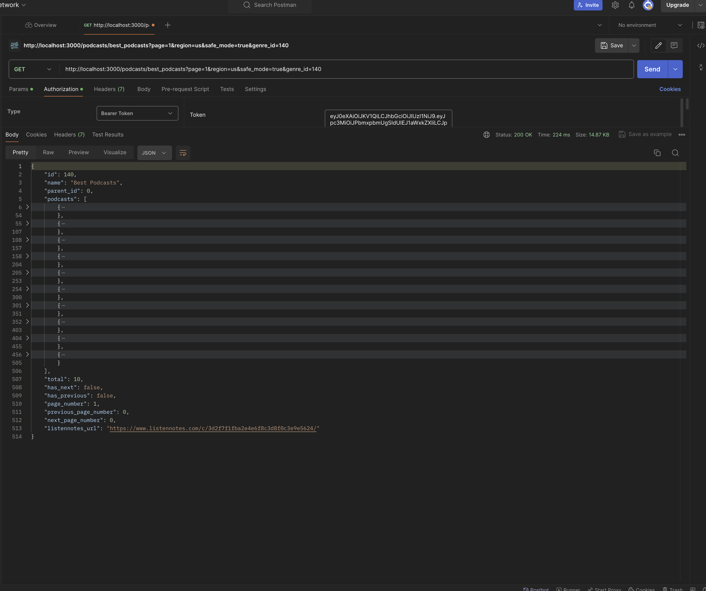
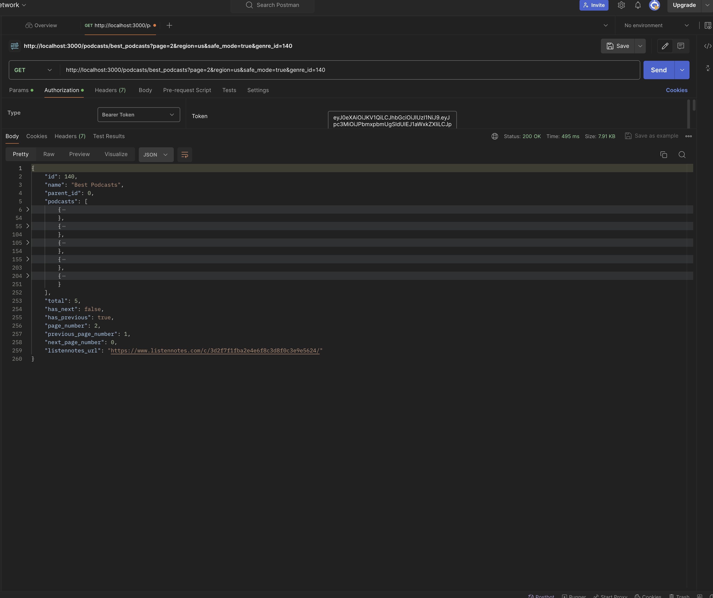

# CREED CODECHALLENGE

This application is to test an individuals knowledge of javascript/node.

## VIDEO RESOURCES
* [Node.js Crash Course](https://www.youtube.com/watch?v=U8XF6AFGqlc)
* [NEST.js Crash Course](https://www.youtube.com/watch?v=wqhNoDE6pb4)

## Commands To use in the terminal
* ``` nest g resource <resource-name> ```
    * This will prompt ask you which architect you want to use
        *  REST API (Application built on REST API)
           * REST API (like the menu) defines a set of rules for how different software applications can talk to each other over the internet. It uses standard commands, like GET (fetch data) and POST (send data), to exchange information (CRUD).
        *  GraphQL (code first) 
            * In code-first GraphQL, developers start by writing the functions and data they need. They decide what data to fetch or send as they build the application. It's like crafting a story where you create characters and events on the fly, shaping the narrative as you go along.
        *  GraphQL (schema first) 
            * In schema-first GraphQL, developers start by defining the data they need. They create a blueprint of the data structure and relationships between objects. It's like creating a storyboard where you plan the characters and events before you start writing the story.
        *  Microservice (non-HTTP) 
            * Microservices (like the buffet) break down an application into smaller, independent services. Each service has its own codebase, database, and communication method. It's like a buffet where you can choose from a variety of dishes, each with its own unique flavor.
        *  WebSockets 
            * WebSockets (like the chat room) 
                * WebSockets provide a full-duplex communication channel over a single, long-lived connection. It allows real-time data transfer between the client and server. It's like a chat room where you can send and receive messages instantly.
* ``` nest g service <service-name> ```
    * This will create a service file in the services folder
* ``` nest g module <module-name> ```
    * This will create a module file in the modules folder
* ``` nest g controller <controller-name> ```
    * This will create a controller file in the controllers folder


## TECH STACK
Nodejs
Nextjs - A nodejs framework for building full stack applications. It uses typescript and is built on top of express. 
Typescript - A superset of javascript that adds types to the language. It is a statically typed language that compiles down to javascript. 
Firebase Firestore - A NoSQL database that is part of the firebase suite of tools. It is a document database that stores data in collections and documents.

## Project Structure
*   Api Layer
    * app.controller was created to handle the CRUD calls coming in getBest_Podcast

*   Services Layer
    * app.services establishes the connection with firebase and performs a get function to retrieve all of the data within the podcast collection. we then use the query parameters sent in to filter through the data brought back.

*   Domain layer
    * in the interface folder we have defined the domain models

* Data Layer
    * firestore folder continas an import javascript that uploads a json file to the podcast collection. 
    * we defined the service account values to access the firebase api
    * we also initialize the firebase within the app.service

## Installation
Some machines do come preinstalled with node but if you don't have node installed run this on your 

* Mac Terminal install
    * download and installs Homebrew (macOS/Linux Package Manager)
        ```bash
        curl -o- https://raw.githubusercontent.com/Homebrew/install/HEAD/install.sh | bash
        ```
    * download and install Node.js
        ```bash
        brew install node@20
        ```
    * verifies the right Node.js version is in the environment
        ```bash
        node -v # should print `v20.12.0`
        ```
    *  verifies the right NPM version is in the environment
        ```bash
        npm -v # should print `10.5.0`
        ```

* Download link
    * https://nodejs.org/en/download

After node is installed run 
* run ```bash npm install ```
    * This will install all packages listed in the package.json
    * Also run ```bash npm outdated ``` to get a list of outdated packages to make sure vulnerabilities are taking care of.
    * Recommended to update/upgrade packages individually to avoid breaking changes or not able to indicate which package upgrade broke what.

## Run Application
To properly test this application,
* run ```bash npm run start ```
    * this will run the application
* install Postman(to run application locally)
    * https://www.postman.com/downloads/
    * application will be running on http://localhost:3000
        * http://localhost:3000/podcasts/best_podcasts?page=1&region=us&safe_mode=true&genre_id=140

## Output - Results




